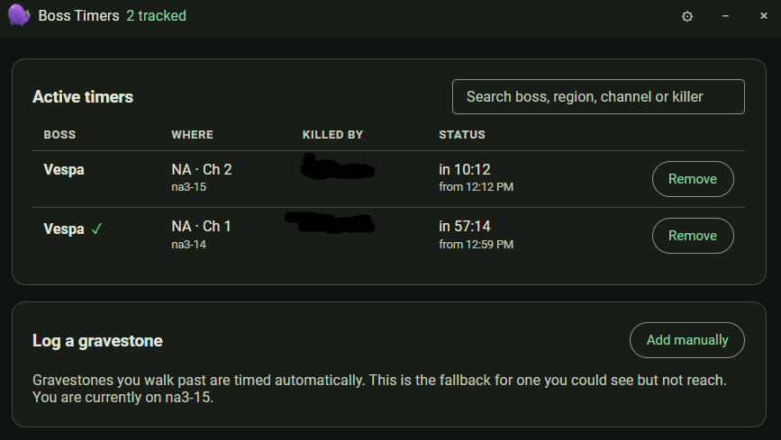
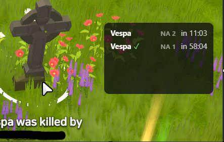



Boss Timers tracks world boss respawns by region and channel. Gravestones you
walk past are timed automatically; the current channel is shown at the bottom
of the window.

Each row shows the boss, where it died (region and channel), who killed it, and
when it is next up. A green check marks a timer you can rely on. Use **Add
manually** to log a gravestone you could see but not reach, and **Remove** to
clear one.

## Overlay tile

The boss timer overlay tile shows the next respawns for your current region.

Press `Ctrl+Shift+8` to cycle the tile between regions when you have timers in
more than one.
