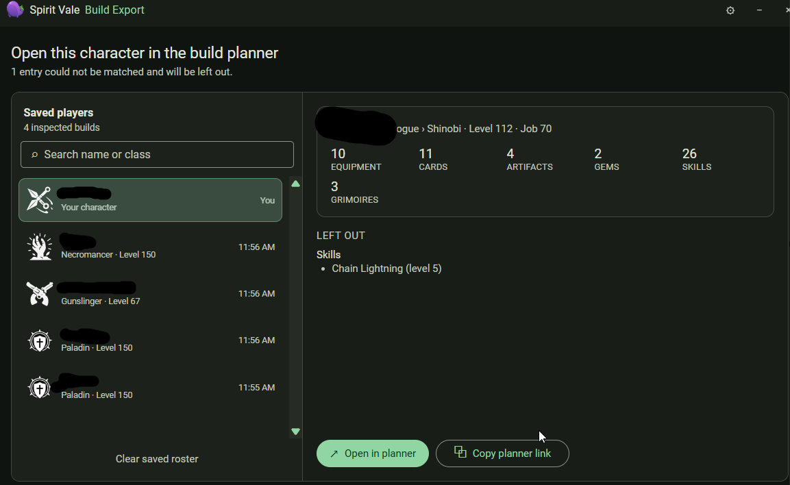



Build Export takes a character you have inspected and opens it in the
[spiritvalers.com](https://spiritvalers.com) build planner.

The left panel is your saved roster of inspected builds — your own character
plus anyone you have inspected recently. Select one to see its summary:
equipment, cards, artifacts, gems, skills, and grimoires. Anything that could
not be matched to a planner entry is listed under **Left out**.

Use **Open in planner** to launch it in your browser, or **Copy planner link**
to share it. **Clear saved roster** empties the list.
