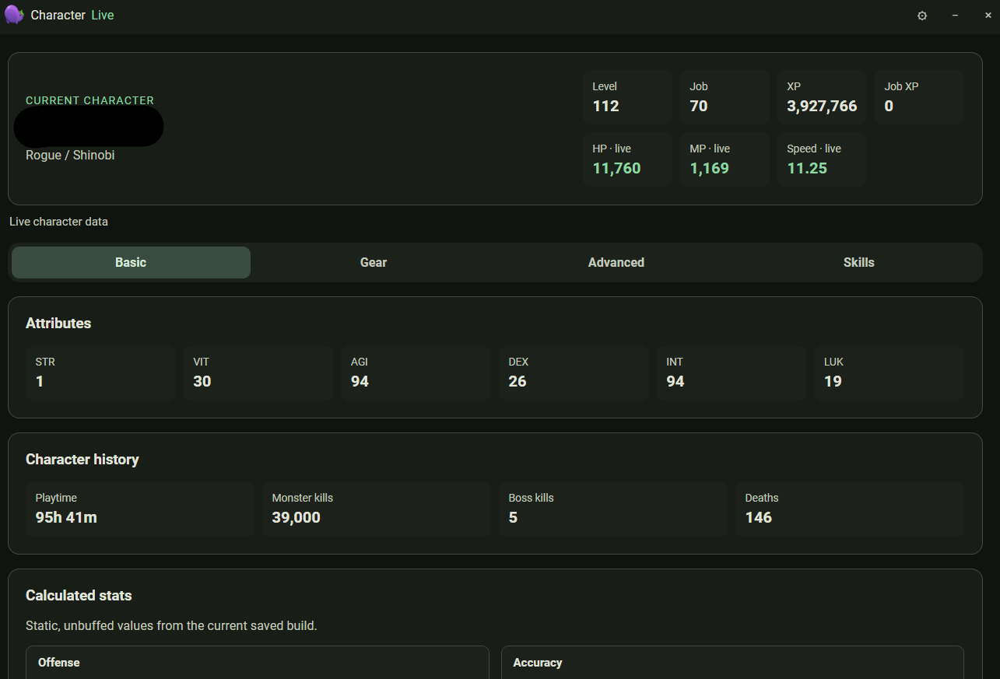



The Character window shows live data for your current character alongside the
stats calculated from your saved build.

The header shows class, level, job, XP, and live HP, MP, and speed. Below it,
tabs split the detail into **Basic**, **Gear**, **Advanced**, and **Skills**.

- **Attributes** — STR, VIT, AGI, DEX, INT, and LUK.
- **Character history** — playtime, monster kills, boss kills, and deaths.
- **Calculated stats** — static, unbuffed offense and accuracy values from the
  current saved build.
