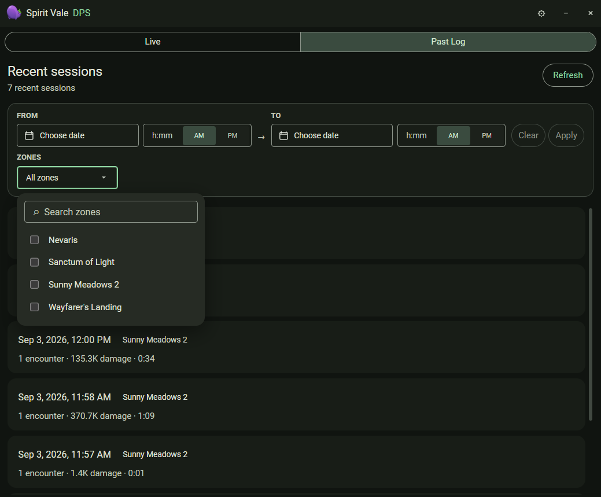
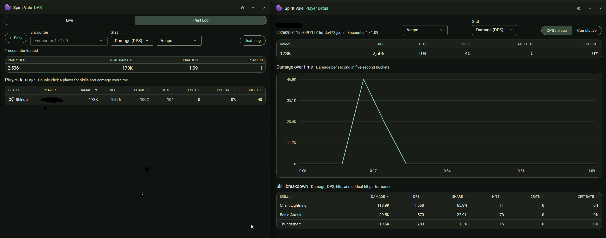
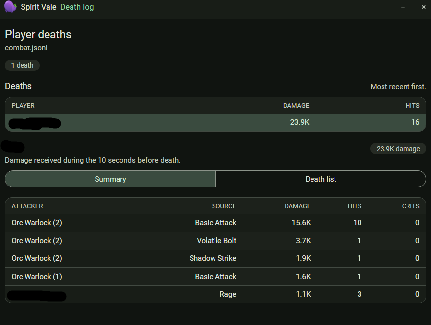



The Combat window watches the current `combat.jsonl` log and gives you live
DPS plus full analysis of past encounters.

## Combat logs

The analysis view breaks each encounter down by player: total damage, DPS,
damage share, hits, crits, crit rate, and kills. Pick an encounter from the
selector, and filter to a single enemy or **All enemies**.

Switch between **Live** and **Past Log** to review earlier sessions. How many
past sessions are kept is set in
[Settings > Combat](settings.md#combat).

## Past sessions

**Past Log** lists recent sessions, each showing its start time, zone, encounter
count, total damage, and duration. Narrow the list with the **From** / **To**
date and time fields and the **Zones** filter, then **Apply**; **Clear** resets
the filters and **Refresh** re-scans the log folder.

## Player detail

Double-click a player to open their detail view — damage over time in
five-second buckets, and a per-skill breakdown with damage, DPS, share, hits,
and crit rate. The enemy filter also applies here.

## Death log

Press `Ctrl+Shift+3` to open the live death log, or open it from the analysis
view. It lists each player death and the damage taken in the ten seconds
before it, grouped by attacker and source.

Because capture is proximity-based, damage reported for other players drops
when they move out of capture range.
