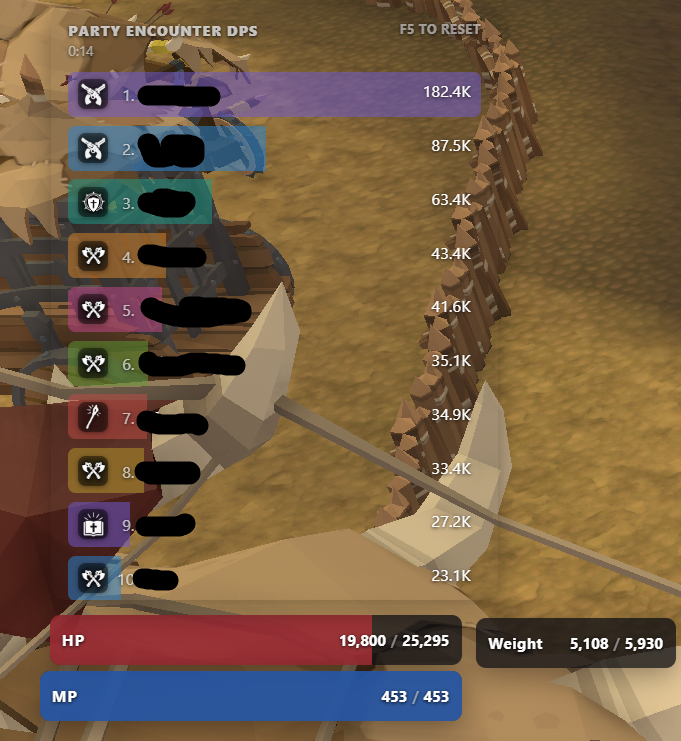
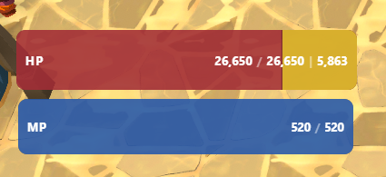
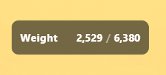
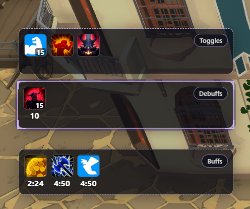
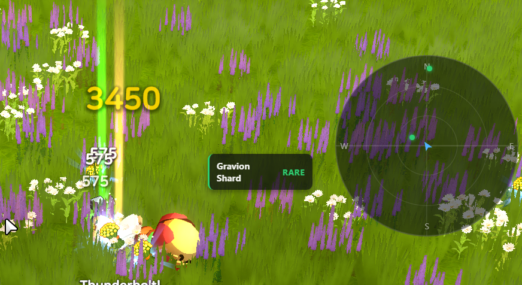
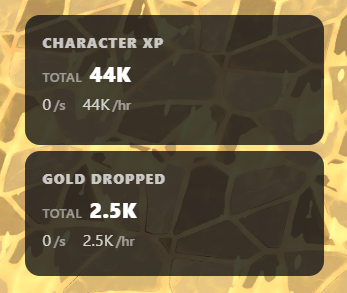
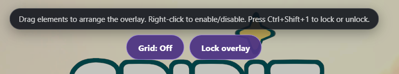
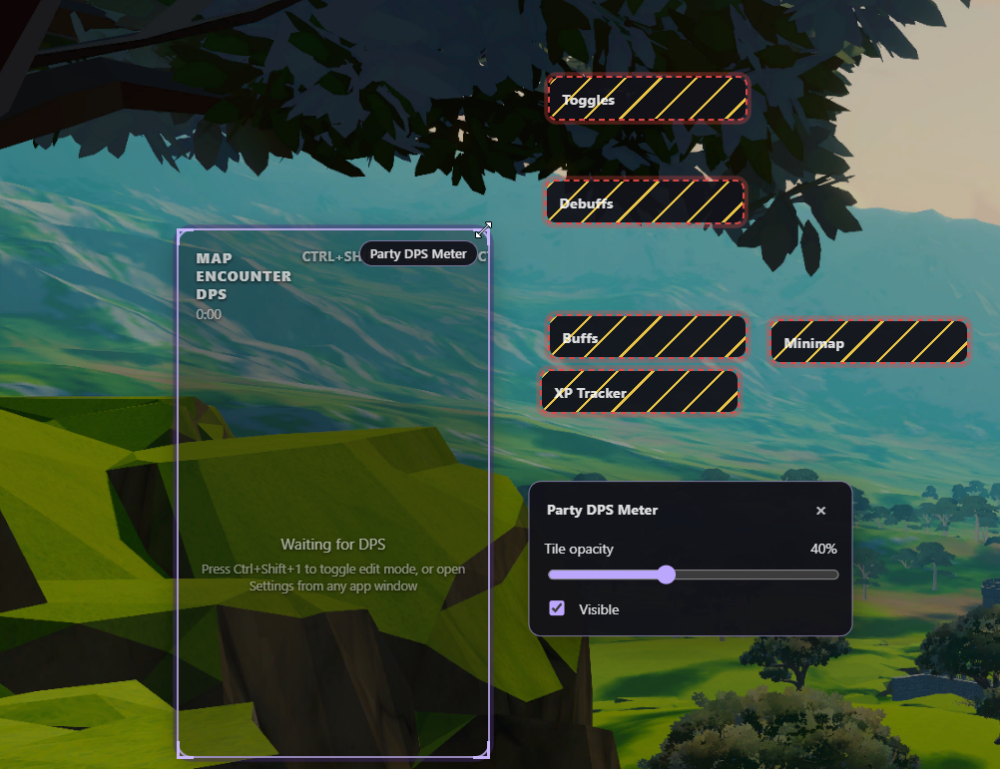
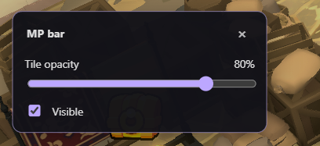



The overlay draws live information on top of the game. Press `Ctrl+Shift+4` to
show or hide it, and `Ctrl+Shift+1` to unlock it for editing.

## Party DPS meter

The party meter ranks everyone in capture range by damage for the current
encounter, with the encounter timer at the top.

Press `Ctrl+Shift+5` to cycle the meter between views, and `Ctrl+Shift+2` to
reset the session. Because capture is proximity-based, DPS for other players
drops when they move out of range.

## HP, MP, and weight

The HP bar shows current and maximum health, with the shield value alongside
when you have one. The weight tile shows your current load against your
capacity.

## Buffs, debuffs, and toggles

The buff bar groups active effects into **Toggles**, **Debuffs**, and
**Buffs**, each with its remaining duration.

Selecting buffs to warn on is covered in [Settings](settings.md#status).

## Minimap and loot

The minimap tile shows nearby loot drops around your position, filtered by the
rarity and drop-chance thresholds set in
[Settings > Minimap / Loot](settings.md#minimap--loot).

## XP and gold trackers

Each tracker shows a running total plus per-second and per-hour rates.
`Ctrl+Shift+6` resets all-time XP and `Ctrl+Shift+7` resets all-time gold.

## Editing the layout

Press `Ctrl+Shift+1` to unlock the overlay. Drag tiles to arrange them,
right-click a tile to enable or disable it, and toggle the alignment grid from
the edit bar.

Each tile has its own opacity slider and a visibility checkbox in edit mode.

Which tiles are available, and which display each lands on, is set in
[Settings > Overlay](settings.md#overlay).

## Default hotkeys

| Shortcut | Action |
| --- | --- |
| `Ctrl+Shift+1` | Lock or unlock the overlay |
| `Ctrl+Shift+2` | Reset the session |
| `Ctrl+Shift+3` | Open the live death log |
| `Ctrl+Shift+4` | Show or hide the overlay |
| `Ctrl+Shift+5` | Cycle the party meter |
| `Ctrl+Shift+6` / `Ctrl+Shift+7` | Reset all-time XP / gold |
| `Ctrl+Shift+8` | Cycle the boss timer tile between regions |
| `Tab` | Show or hide the minimap |

All of these can be rebound in **Settings > Keybinds**. Hotkeys pass through to
the foreground program, so its normal action for the same combination still
runs. Windows may also use Ctrl+Shift to switch input languages when configured
that way.
