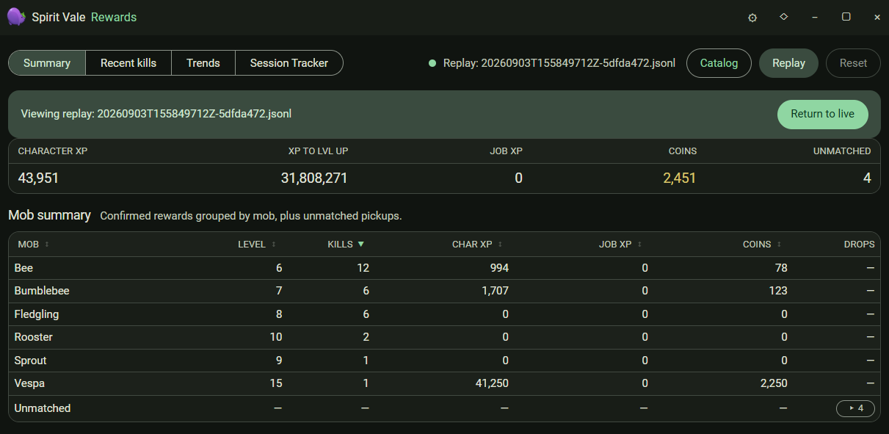



The Rewards window groups confirmed rewards by mob and tallies XP, job XP, and
coins for the session.

Tabs across the top switch between **Summary**, **Recent kills**, **Trends**,
and **Session Tracker**. The totals row covers character XP, XP to level up,
job XP, coins, and unmatched pickups.

Use **Replay** to load a past session and **Catalog** to browse known mob
rewards. **Return to live** switches back from a replay. How many past
sessions are kept is set in [Settings > Combat](settings.md#combat).
