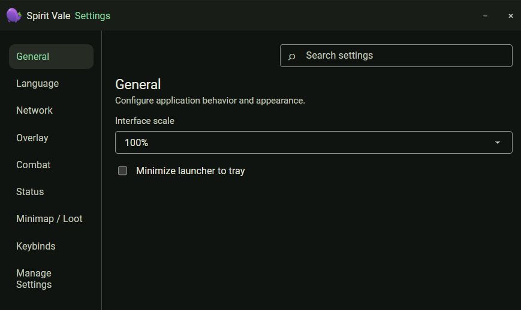
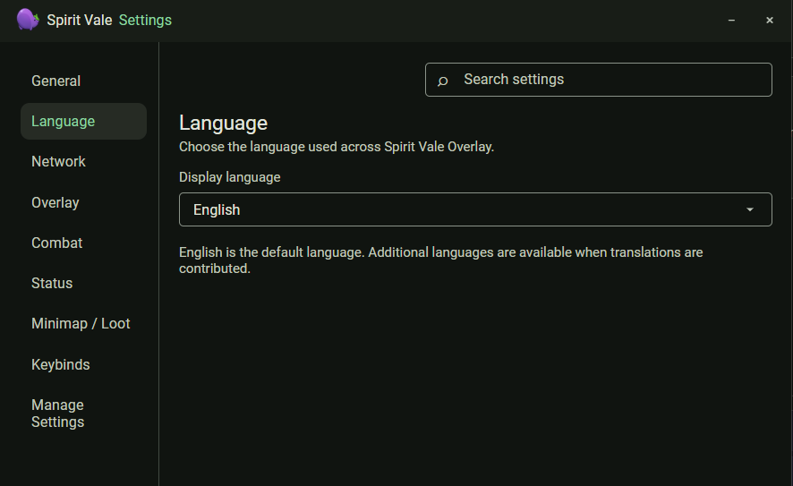
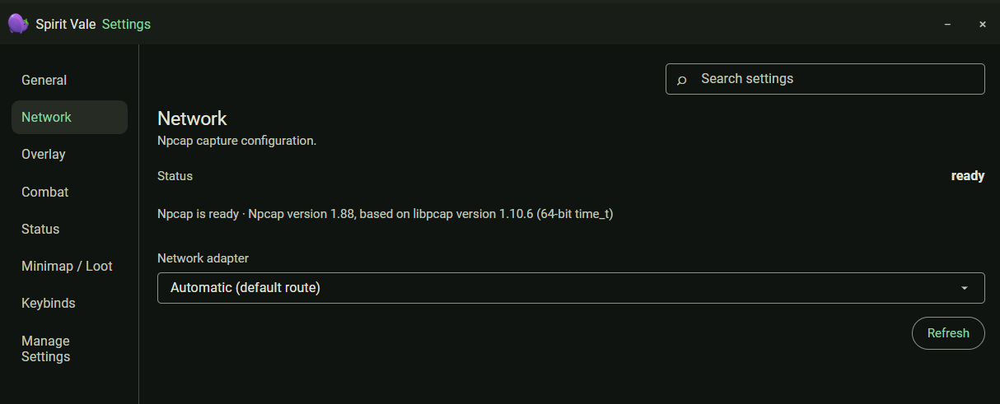
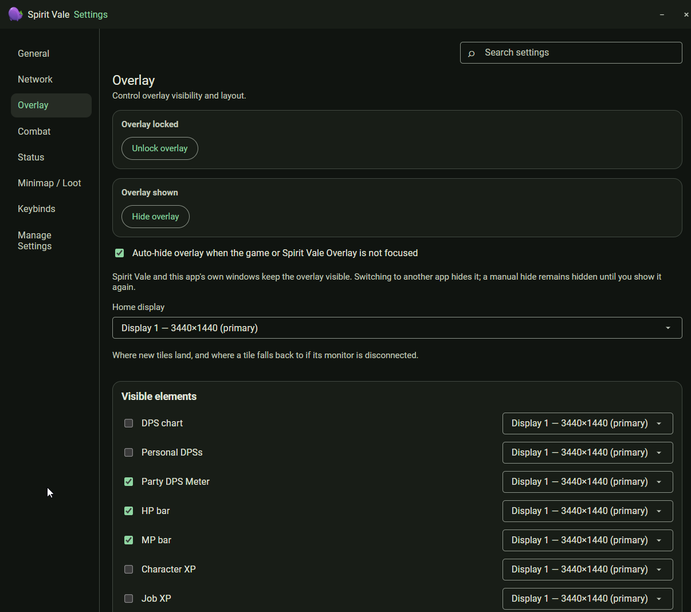
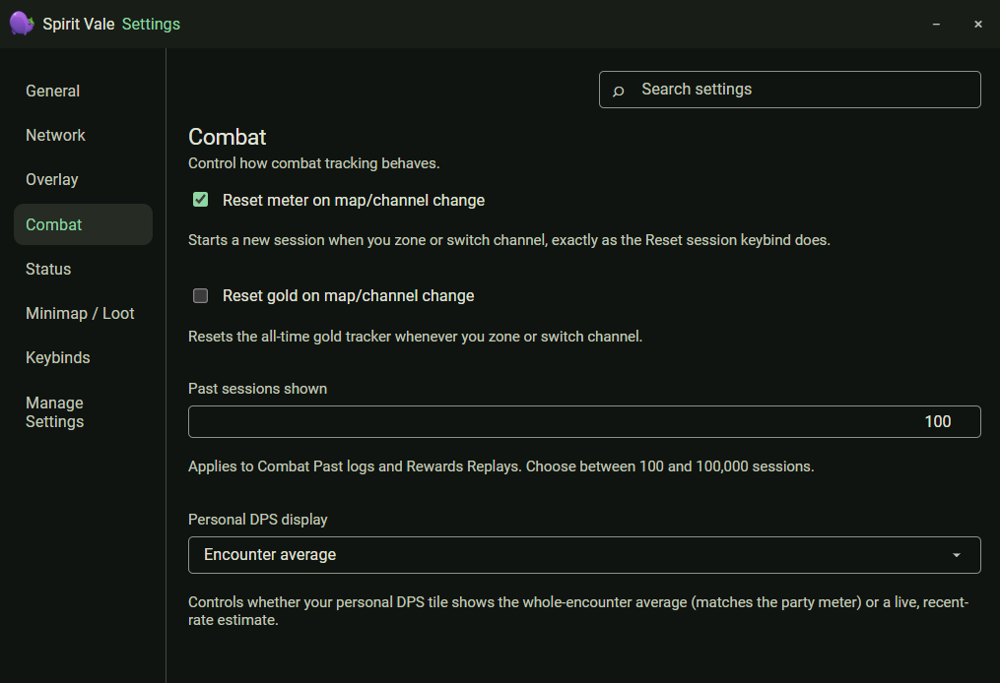
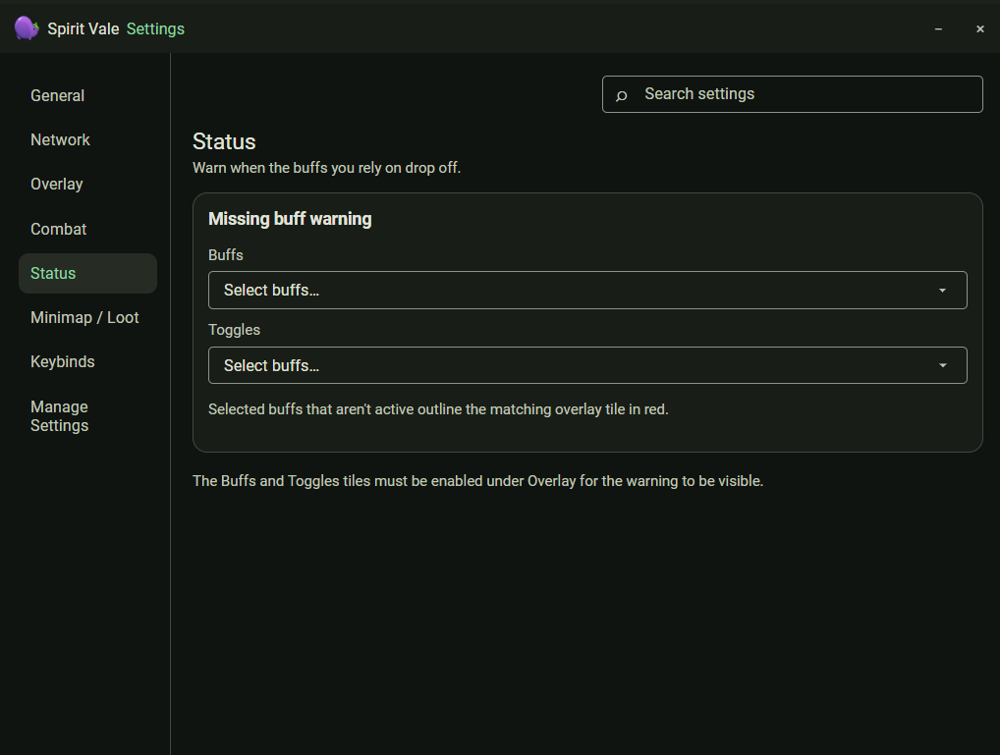
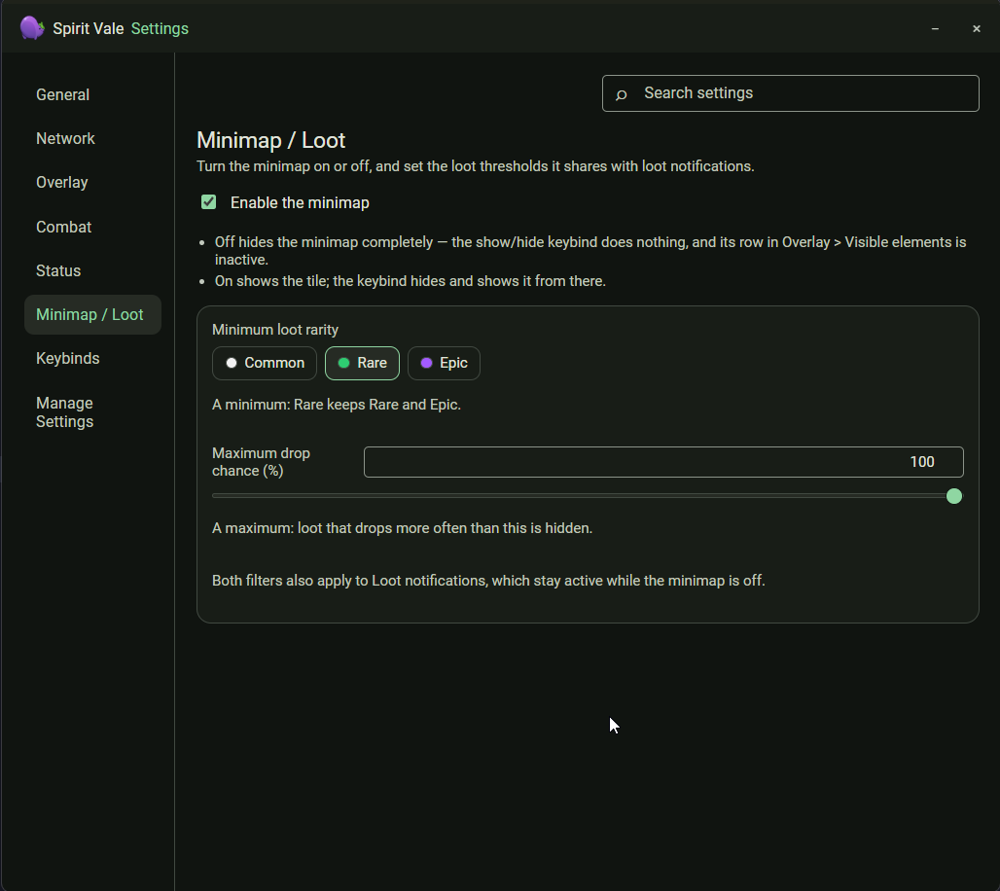
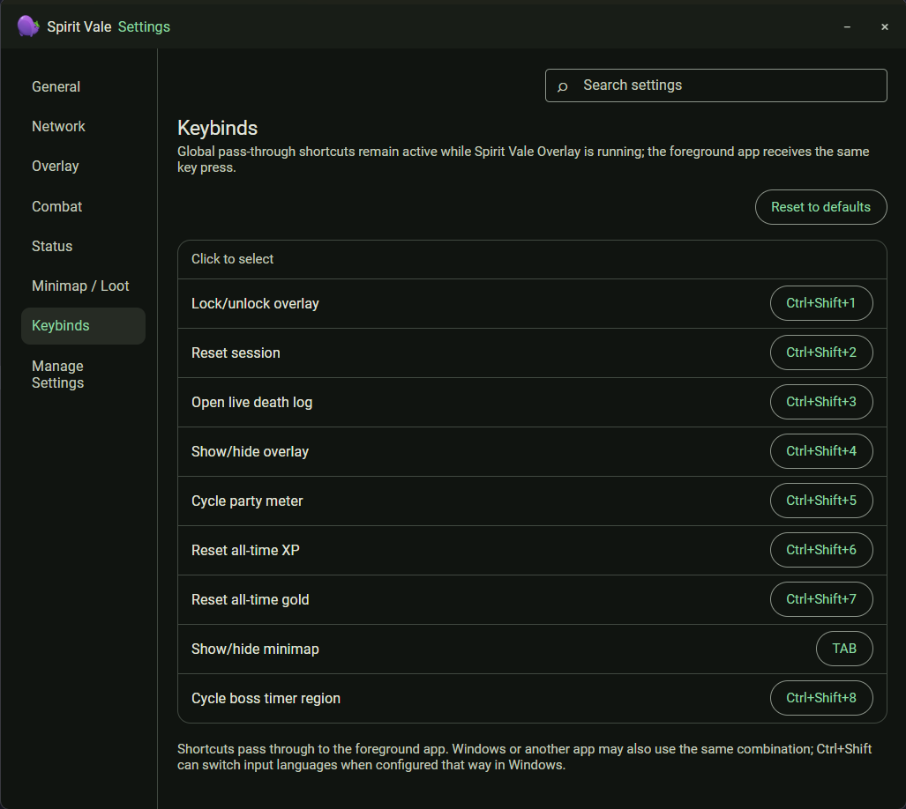
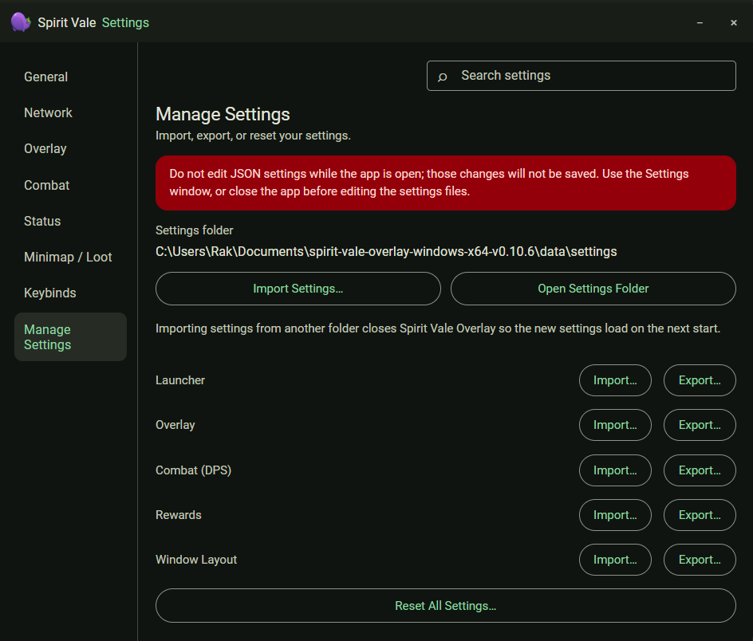



The Settings window is shared by every tool and opens from any Spirit Vale
Overlay window. Use the search box at the top to jump to a specific setting.

## General

Interface scale and whether the launcher minimizes to the system tray.

## Language

Choose the language used across the app. English is the default; other
languages appear as translations are contributed.

## Network

Npcap capture configuration. The status line confirms Npcap is ready and shows
its version. Leave the network adapter on **Automatic (default route)** unless
capture is not working — see the
[troubleshooting guide](../TROUBLESHOOTING.md). **Refresh** re-checks Npcap and
the adapter list.

## Overlay

Lock or unlock the overlay, show or hide it, and choose the home display where
new tiles land. **Auto-hide overlay when the game or Spirit Vale Overlay is not
focused** keeps the overlay visible only while the game or one of this app's
windows is in front.

**Visible elements** lists every tile with a checkbox and its own display
selector, so individual tiles can live on different monitors.

## Combat

- **Reset meter on map/channel change** — starts a new session when you zone or
  switch channel, the same as the Reset session keybind.
- **Reset gold on map/channel change** — resets the all-time gold tracker on a
  zone or channel switch.
- **Past sessions shown** — how many sessions Combat past logs and Rewards
  replays keep, between 100 and 100,000.
- **Personal DPS display** — whether your personal DPS tile shows the
  whole-encounter average (matching the party meter) or a live recent-rate
  estimate.

## Status

Warn when buffs you rely on drop off. Select buffs and toggles to watch;
when one is not active, its overlay tile outlines in red. The Buffs and
Toggles tiles must be enabled under Overlay for the warning to show.

## Minimap / Loot

Turn the minimap on or off and set the loot thresholds it shares with loot
notifications.

- **Minimum loot rarity** — Common, Rare, or Epic. A minimum of Rare keeps Rare
  and Epic.
- **Maximum drop chance (%)** — loot that drops more often than this is hidden.

Both filters also apply to loot notifications, which stay active while the
minimap is off.

## Keybinds

Every global pass-through shortcut, with **Reset to defaults**. Click a binding
and press the new combination to change it. Shortcuts pass through to the
foreground app, so its normal action for the same combination still runs, and
Windows may use Ctrl+Shift to switch input languages when configured that way.

## Manage Settings

Import, export, or reset your settings. Each area — Launcher, Overlay, Combat
(DPS), Rewards, and Window Layout — exports and imports on its own. The
settings folder path is shown at the top, with **Open Settings Folder**.

Do not edit the JSON settings files while the app is open; those changes are
not saved. Importing settings from another folder closes the app so the new
settings load on the next start.
