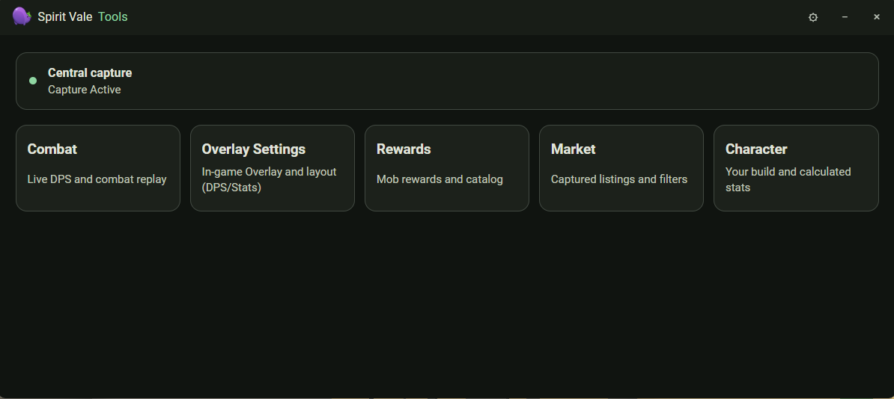
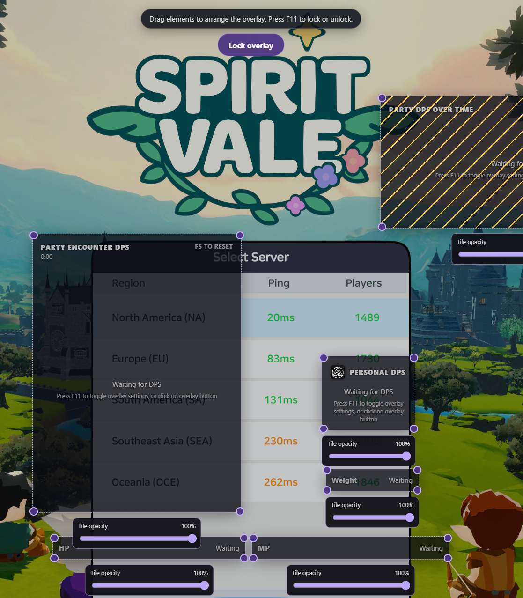
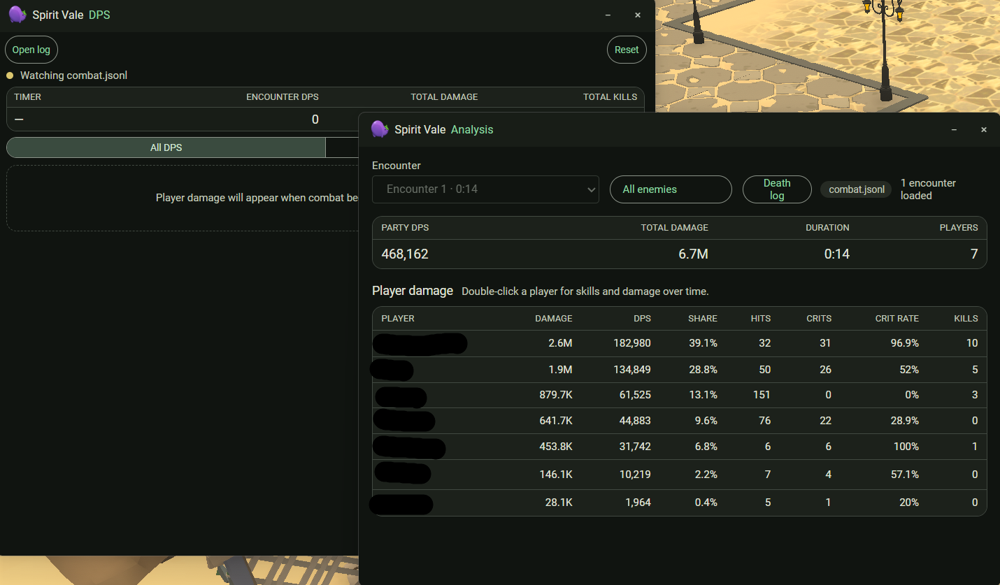
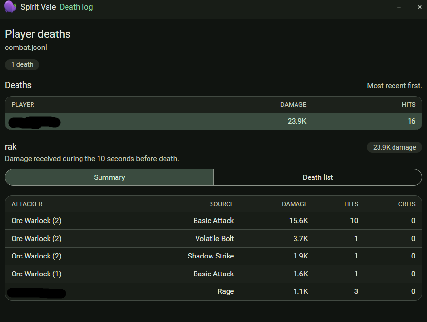
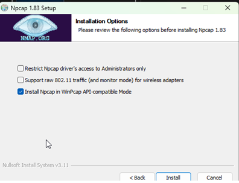

## What you get

The launcher gives you quick access to combat DPS, rewards, and character tools.
The shared Settings window holds general, network, overlay, and keybind
configuration.

The in-game overlay shows live party DPS along with HP/MP during combat. Press
`Ctrl+Shift+4` to show or hide it, and `Ctrl+Shift+1` to unlock it and drag
elements into the layout you want.

Combat logs break down per-player damage, DPS, crit rate, and kills, and the
death log shows the hits taken in the seconds before a death.

Because capture is proximity-based, DPS reported for other players drops when
they move out of capture range.

## Requirements

- 64-bit Windows 10 version 1809 or newer, or Windows 11.
- [Npcap](https://npcap.com/#download) — see the pre-install step below.
- [Microsoft Edge WebView2 Runtime](https://developer.microsoft.com/en-us/microsoft-edge/webview2/),
  already present on most up-to-date Windows installations.

The portable release bundles everything else it needs, including its Bun
runtime. There is nothing else to install.

## Pre-install

Before installing Spirit Vale Overlay, download and install Npcap from
[npcap.com/#download](https://npcap.com/#download). Select **Install Npcap in
WinPcap API-compatible Mode** and leave **Restrict Npcap driver's access to
Administrators only** unchecked.

## Portable release

1. Download the latest `spirit-vale-overlay-windows-x64-v*.zip` from [GitHub Releases](https://github.com/kar-mi/spirit-vale-overlay/releases/latest).
2. Extract the complete ZIP. It contains one versioned folder, such as `spirit-vale-overlay-windows-x64-v0.10.5`.
3. Open that folder and run `spirit-vale-overlay-win_x64.exe`.

The portable app supports Windows x64 and, by default, keeps its settings, logs, and writable runtime data inside the extracted folder.

To store data in Windows AppData instead:

1. Close Spirit Vale Overlay completely.
2. Delete `.spirit-vale-portable` from the extracted application folder.
3. Restart the app. New data will be stored under `%APPDATA%\Spirit Vale Overlay\data`.

Deleting the marker does not move existing portable data. To keep your current settings, open **Settings > Manage Settings** before deleting it and export them, then import them after restarting. You can also import directly from the old extracted folder's `data` directory.

## Default hotkeys

| Shortcut | Action |
| --- | --- |
| `Ctrl+Shift+1` | Lock or unlock the overlay |
| `Ctrl+Shift+2` | Reset the session |
| `Ctrl+Shift+3` | Open the live death log |
| `Ctrl+Shift+4` | Show or hide the overlay |
| `Ctrl+Shift+5` | Cycle the party meter |
| `Ctrl+Shift+6` / `Ctrl+Shift+7` | Reset all-time XP / gold |
| `Ctrl+Shift+8` | Cycle the boss timer tile between regions |

All of these can be rebound in **Settings > Keybinds**. Hotkeys pass through to
the foreground program, so its normal action for the same combination still
runs. Windows may also use Ctrl+Shift to switch input languages when configured
that way.

## If something goes wrong

If the app does not start, shows a blank window, or cannot capture game traffic, see the [Windows troubleshooting guide](TROUBLESHOOTING.md). Using a VPN or network optimizer such as ExitLag needs [extra configuration](vpn/VPN_ISSUES.md).
