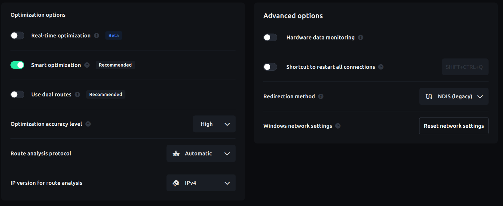

Some VPN and network-optimization tools change how game packets reach your
machine, which can stop Spirit Vale Overlay from capturing traffic.

## ExitLag

ExitLag recently updated their settings, which changed how they redirect
packets. If the overlay shows no combat data while ExitLag is active, open
ExitLag's settings and apply the following:

- **Optimization options > Use dual routes** — off
- **Optimization options > IP version for route analysis** — `IPv4`
- **Advanced options > Redirection method** — `NDIS (legacy)`

Then restart your connection and the game.

